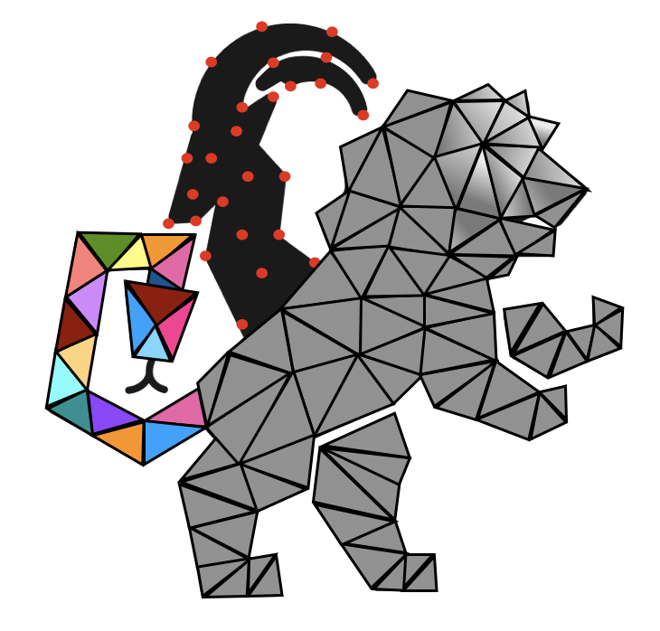
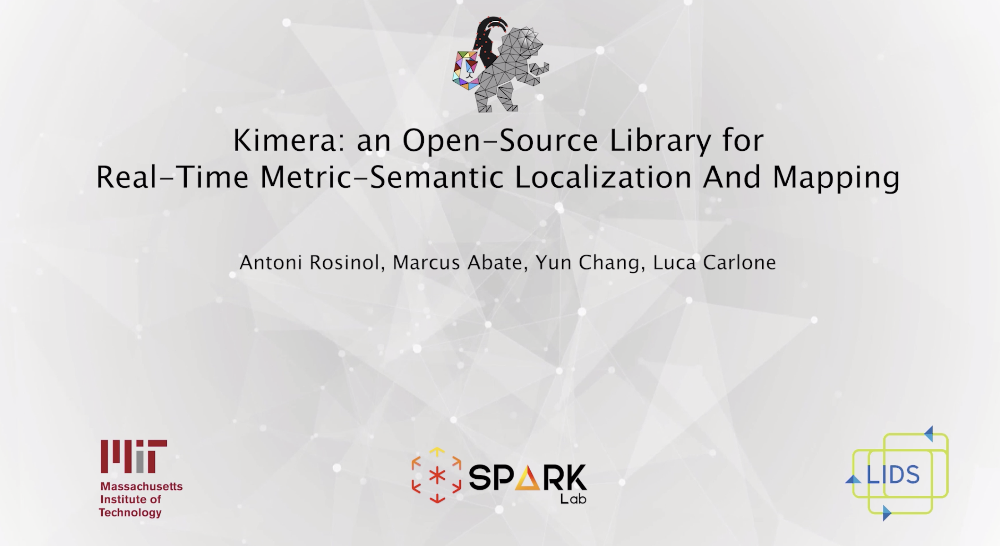
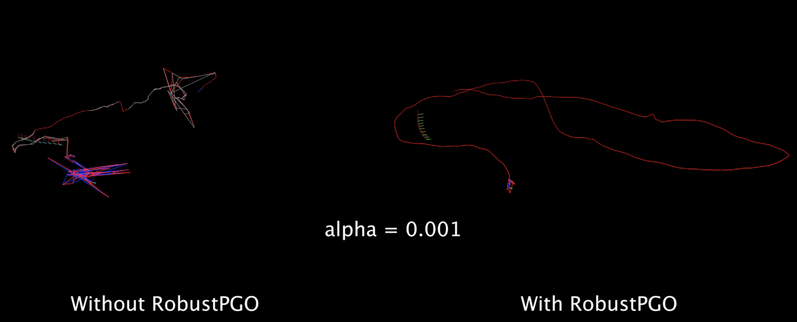
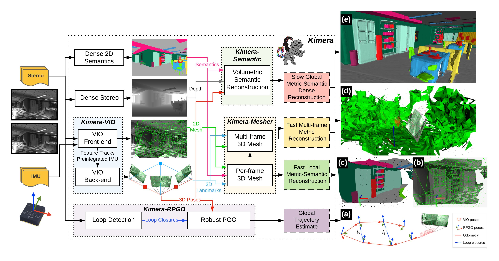

<div align="center">
  <a href="http://mit.edu/sparklab/">
    
  </a>
  <a href="https://www.mit.edu/~arosinol/">
    
  </a>
  <a href="https://mit.edu">
    
  </a>
</div>

# Kimera

Kimera is a C++ library for real-time metric-semantic simultaneous localization and mapping, which uses camera images and inertial data to build a semantically annotated 3D mesh of the environment. Kimera is modular, ROS-enabled, and runs on a CPU.

Kimera comprises four **modules**:
- A fast and accurate Visual Inertial Odometry (VIO) pipeline ([Kimera-VIO](https://github.com/MIT-SPARK/Kimera-VIO))
- A full SLAM implementation based on Robust Pose Graph Optimization ([Kimera-RPGO](https://github.com/MIT-SPARK/Kimera-RPGO))
- A per-frame and multi-frame 3D mesh generator ([Kimera-Mesher](https://github.com/MIT-SPARK/Kimera-VIO))
- And a generator of semantically annotated 3D meshes ([Kimera-Semantics](https://github.com/MIT-SPARK/Kimera-Semantics))

<p align="center">
    <a href="https://www.youtube.com/watch?v=-5XxXRABXJs">
    
    </a>
</p>

Click on the following links to install Kimera's modules and get started! It is very easy to install!

### [Kimera-VIO & Kimera-Mesher](https://github.com/MIT-SPARK/Kimera-VIO)

<div align="center">
    <a href="https://github.com/MIT-SPARK/Kimera-VIO">
      
   </a>
</div>

### [Kimera-RPGO](https://github.com/MIT-SPARK/Kimera-RPGO)

<div align="center">
  <a href="https://github.com/MIT-SPARK/Kimera-RPGO">
    
  </a>
</div>

### [Kimera-Semantics](https://github.com/MIT-SPARK/Kimera-Semantics)

<div align="center">
  <a href="https://github.com/MIT-SPARK/Kimera-Semantics">
    
  </a>
</div>

### Chart



## Citation
If you found any of the above modules useful, we would really appreciate if you could cite our work:

 - A. Rosinol, M. Abate, Y. Chang, L. Carlone. [**Kimera: an Open-Source Library for Real-Time Metric-Semantic Localization and Mapping**](https://arxiv.org/abs/1910.02490). arXiv preprint [arXiv:1910.02490](https://arxiv.org/abs/1910.02490).
 ```bibtex
 @misc{Rosinol19arxiv-Kimera,
   title = {Kimera: an Open-Source Library for Real-Time Metric-Semantic Localization and Mapping},
   author = {Rosinol, Antoni and Abate, Marcus and Chang, Yun and Carlone, Luca},
   year = {2019},
   eprint = {1910.02490},
   archiveprefix = {arXiv},
   primaryclass = {cs.RO},
   url = {https://github.com/MIT-SPARK/Kimera},
   pdf = {https://arxiv.org/pdf/1910.02490.pdf}
 }
```

## Acknowledgments

Kimera was partially funded by the [DCIST](https://www.dcist.org/) (Distributed and Collaborative Intelligent Systems and Technology) Collaborative Research Alliance. 

## License

[BSD License](LICENSE.BSD)
